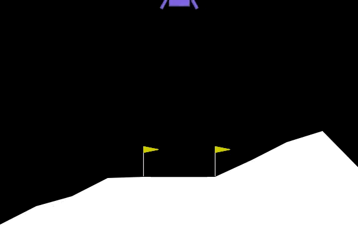

# Deep Q-Learning - Lunar Lander

This guided project, marked as **C3_W3_A1_Assignment**, is an essential component of the comprehensive **Unsupervised Learning, Recommenders, and Reinforcement Learning** specialization offered jointly by OpenAI and Stanford University. The specialization is made available through the renowned online learning platform, Coursera. You can find more about the specialization and enroll in it [here](https://www.coursera.org/specializations/machine-learning-introduction).

## Reinforcement Learning (RL) Brief

Reinforcement Learning, often abbreviated as RL, is a machine learning paradigm that empowers agents to learn by interacting with their environment. In the realm of lunar landing, RL equips our digital explorer with the ability to make sequential decisions, optimize actions, and ultimately accomplish complex tasks like successful touchdowns.

## Table of Contents

1. [Introduction](#introduction)
2. [Prerequisites](#prerequisites)
3. [Project Outline](#project-outline)
4. [Implementation](#implementation)
5. [Instructions](#instructions)
6. [Results](#results)
7. [Conclusion](#conclusion)
8. [References](#references)

## Introduction

In this project, we will be implementing Deep Q-Learning, a popular reinforcement learning algorithm, to train an agent in landing a lunar lander safely on a landing pad. The agent will learn to navigate through the moon's gravity and control the lander's thrusters to achieve a successful landing.

## Prerequisites

- Basic understanding of reinforcement learning concepts.
- Familiarity with Python and deep learning libraries (e.g., TensorFlow, PyTorch).
- Installation of required packages and dependencies as mentioned in the course materials.

## Project Outline

The project follows these main steps:

1. Importing necessary packages.
2. Defining hyperparameters for training.
3. Setting up the lunar lander environment.
   - Understanding action space and observation space.
   - Defining rewards and episode termination conditions.
4. Loading the environment.
5. Interacting with the Gym environment to explore dynamics.
6. Implementing Deep Q-Learning.
   - Creating a target network.
   - Experience replay for efficient learning.
7. Constructing the Deep Q-Learning algorithm.
8. Updating network weights through training.
9. Training the agent on the lunar lander environment.
10. Observing the trained agent in action.
11. Concluding the project.

## Implementation

The project involves implementing Deep Q-Learning, which includes creating a neural network to approximate Q-values, experience replay for better sample efficiency, and updating network weights to improve the agent's performance over time.

For detailed code implementation and explanations, please refer to the provided Jupyter notebook or Python scripts.

## Instructions

1. Clone this repository to your local machine.
2. Install the required dependencies as outlined in the course materials.
3. Open the Jupyter notebook or Python scripts provided in your preferred development environment.
4. Follow the step-by-step instructions to implement and train the Deep Q-Learning agent for lunar landing.
5. Experiment with hyperparameters, network architectures, and training strategies to optimize the agent's performance.

## Results

After training the agent, you can expect to see improvements in the agent's ability to successfully land the lunar lander on the designated landing pad. The trained agent should demonstrate learned behaviors that enable it to navigate and control the lander effectively.

## Conclusion

Discover "Unsupervised Learning, Recommenders, and Reinforcement Learning." It's **C3_W3_A1_Assignment**, a game-changer in your machine learning journey. Use Deep Q-Learning to guide lunar landers to success, connecting algorithms and space.

This win boosts your knowledge, weaving into the specialization's fabric, enhancing your machine learning grasp.

As your lunar lander lands, remember this achievement boosts your skills.

Congrats, explorer! On to more missions ahead.

Keep learning! 🚀

## References

If you would like to learn more about Deep Q-Learning, we recommend you check out the following papers.

Mnih, V., Kavukcuoglu, K., Silver, D. et al. Human-level control through deep reinforcement learning. Nature 518, 529–533 (2015).
Lillicrap, T. P., Hunt, J. J., Pritzel, A., et al. Continuous Control with Deep Reinforcement Learning. ICLR (2016).
Mnih, V., Kavukcuoglu, K., Silver, D. et al. Playing Atari with Deep Reinforcement Learning. arXiv e-prints. arXiv:1312.5602 (2013).

https://www.coursera.org/specializations/machine-learning-introduction
